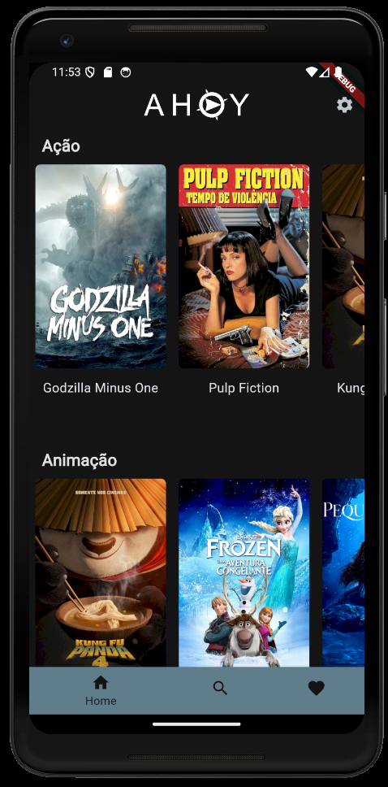
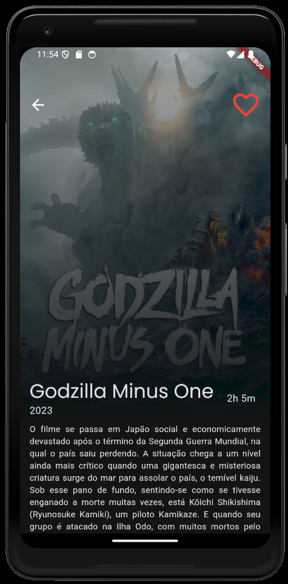
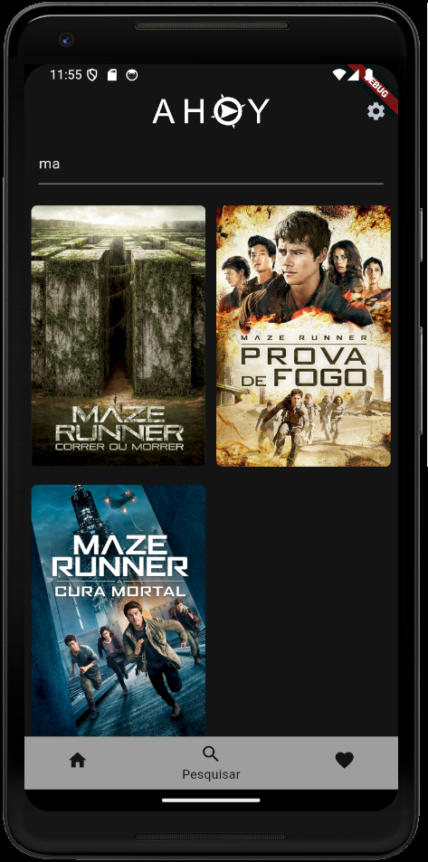
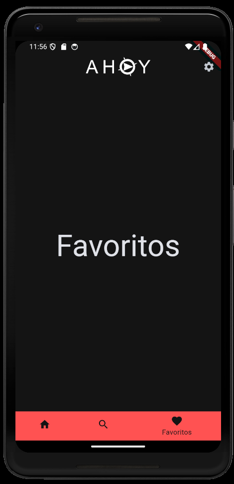

# AHOY - Filmes e Séries

[](https://github.com/guifxb/projeto_flutter_4/blob/main/LICENSE)

# Sobre o projeto

AHOY - Filmes e Séries é uma aplicação mobile construída durante o **Programa Desenvolve**, evento criado pelo [Grupo Boticário](https://www.grupoboticario.com.br/) e a 
[Escola Korú](https://escolakoru.com.br/).

A aplicação consiste em apresentar para seus usuários uma plataforma móvel que permita aos usuários descobrir
facilmente novos conteúdos e explorar informações detalhadas sobre seus filmes e séries favoritos podendo proporcionar uma 
experiência de descoberta de conteúdo intuitiva e envolvente para os usuários, facilitando a navegação por uma ampla
variedade de filmes e séries populares.

## Layout mobile

 
 

# Como executar o projeto

```bash
#clonar repositório
git clone https://github.com/guifxb/projeto_flutter_4.git

#executar o projeto
flutter run
```
# Colaboradores

[Guilherme Félix Bastos](https://www.linkedin.com/in/guilherme-f-bastos/),
[Gabriel Barbosa Mattanó](https://www.linkedin.com/in/gabriel-mattano/),
[Flávia Lopes Gonzaga](https://www.linkedin.com/in/flavialopesgonzaga/) e
[Guilherme Miranda de Jesus](https://www.linkedin.com/in/guimiranda0backend/)


